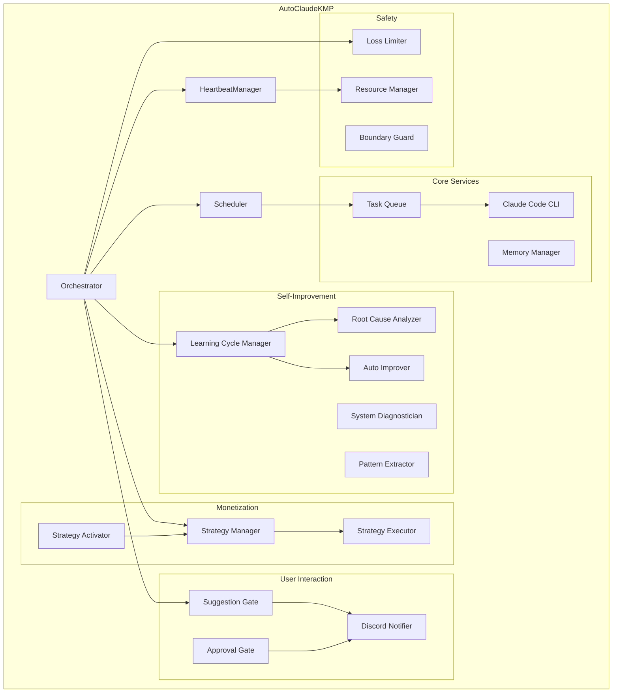
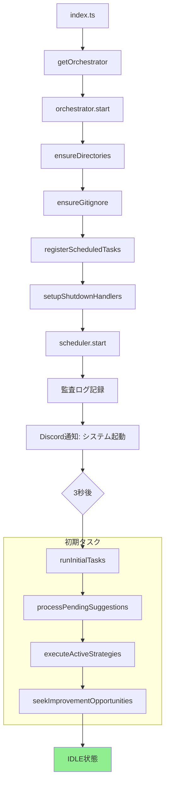
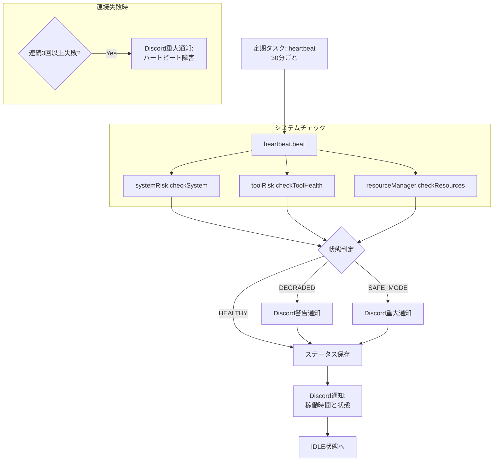
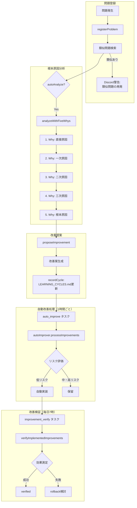
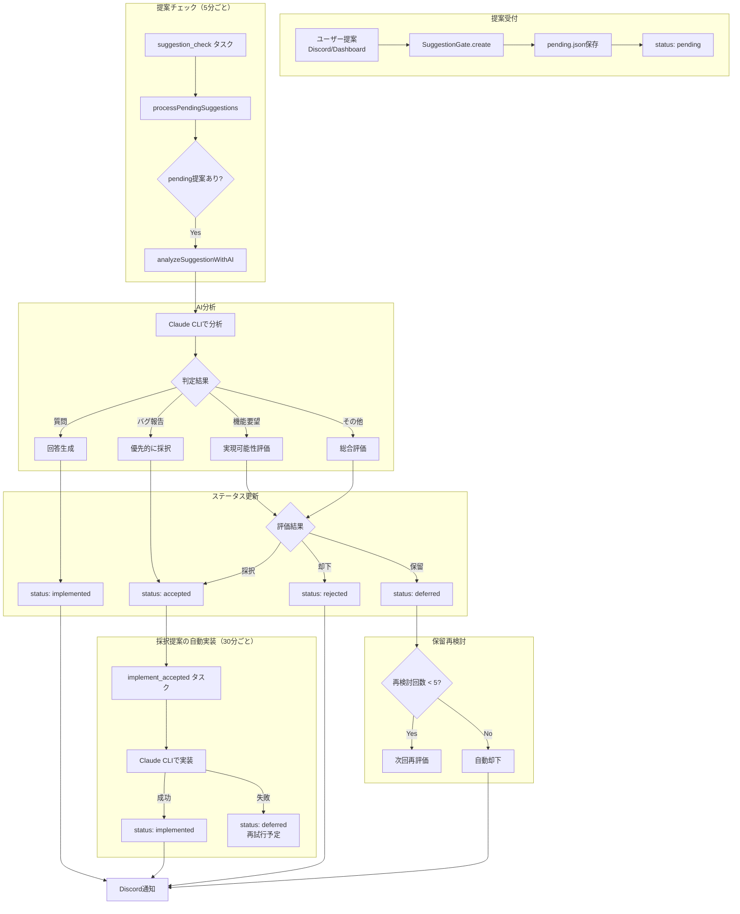
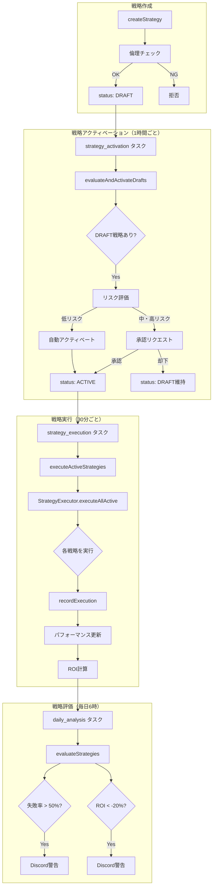
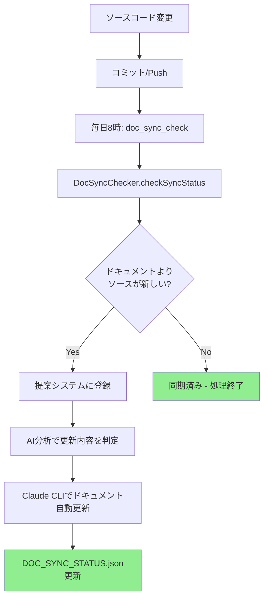
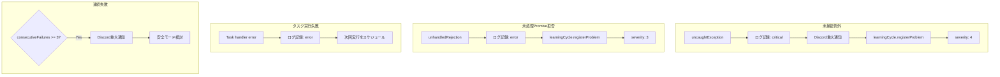

# AutoClaudeKMP システムワークフロー

このドキュメントでは、AutoClaudeKMPの各処理フローをMermaidフローチャートで図解します。

---

## 1. 全体アーキテクチャ図

---

## 2. 起動フロー

システム起動から待機状態までの流れ。

---

## 3. ハートビートフロー

30分ごとの健全性チェック。

---

## 4. 学習サイクルフロー

問題登録から改善実装・検証までの流れ。

---

## 5. 提案システムフロー

ユーザー提案の処理フロー。

---

## 6. 戦略実行フロー

収益化戦略の管理・実行フロー。

---

## 7. ドキュメント同期フロー

ソースコード変更時のドキュメント同期。

---

## 8. 定期タスク一覧

システムで実行される定期タスクの一覧。

| ID | タスク名 | スケジュール | 説明 |
|---|---|---|---|
| `health_check` | ヘルスチェック | 5分ごと | システムの健全性を確認 |
| `suggestion_check` | 提案チェック | 5分ごと | 新規提案をAI分析 |
| `heartbeat` | ハートビート通知 | 30分ごと | 稼働状況をDiscord通知 |
| `strategy_execution` | 戦略実行 | 30分ごと | アクティブ戦略を実行 |
| `implement_accepted` | 採択提案の自動実装 | 30分ごと | 採択された提案を自動実装 |
| `resource_monitor` | リソース監視 | 5分ごと | CPU/メモリを監視 |
| `loss_check` | 損失チェック | 10分ごと | 損失制限を監視 |
| `approval_cleanup` | 承認リクエストクリーンアップ | 1時間ごと | 期限切れリクエストを削除 |
| `improvement_seek` | 改善機会探索 | 1時間ごと | 改善できる箇所を探索 |
| `strategy_activation` | 戦略自動アクティベーション | 1時間ごと | DRAFT戦略を評価・有効化 |
| `auto_improve` | 自動改善処理 | 1時間ごと | 低リスク改善を自動実装 |
| `daily_backup` | 日次バックアップ | 毎日3時 | データをバックアップ |
| `system_diagnosis` | システム診断 | 毎日5時 | 全コンポーネントを診断 |
| `daily_analysis` | 日次分析 | 毎日6時 | 学習レビュー・戦略評価 |
| `improvement_verify` | 改善検証 | 毎日7時 | 実装済み改善の効果を検証 |
| `doc_sync_check` | ドキュメント同期チェック | 毎日8時 | ソースとドキュメントの同期確認 |
| `weekly_report` | 週報生成 | 毎週月曜6時 | 週次レポートを生成 |
| `pattern_extraction` | 成功パターン抽出 | 毎週土曜9時 | 成功パターンを再利用可能な形式に変換 |
| `weekly_retrospective` | 週次振り返り | 毎週日曜21時 | 成功事例・改善点を分析 |

---

## 9. エラーハンドリングフロー

---

## 関連ファイル

| ファイル | 説明 |
|---|---|
| `apps/orchestrator/src/index.ts` | エントリーポイント |
| `apps/orchestrator/src/orchestrator.ts` | メインオーケストレーター |
| `apps/orchestrator/src/scheduler.ts` | 定期タスクスケジューラー |
| `apps/orchestrator/src/heartbeat.ts` | ハートビート管理 |
| `packages/self-improve/src/learning-cycle.ts` | 学習サイクル管理 |
| `packages/notification/src/suggestion-gate.ts` | 提案システム |
| `packages/strategies/src/strategy-manager.ts` | 戦略管理 |

---

*このドキュメントは自動同期システムにより、ソースコード変更時に更新提案が生成されます。*
